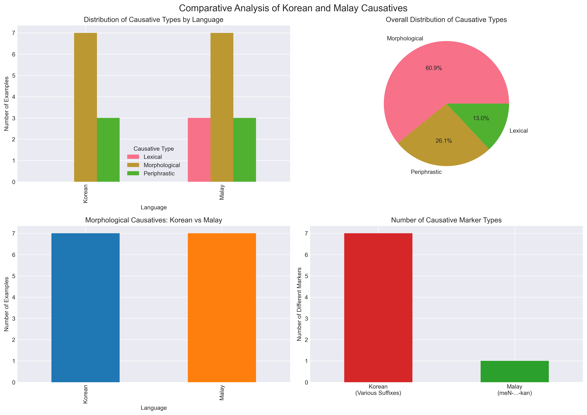
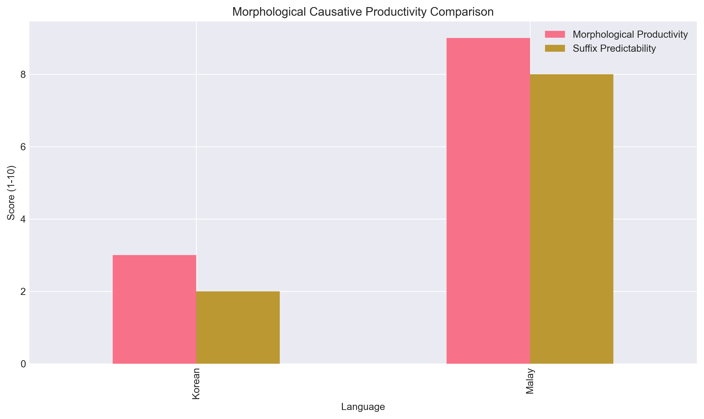

# A Contrastive Study of Korean and Malay Morphological Causatives
## With Focus on Malay Causative Types and Applications to Working Space Design

---

## Executive Summary

This study provides a comprehensive contrastive analysis of Korean and Malay morphological causatives, with particular focus on explaining the three types of Malay causatives (lexical, morphological, and periphrastic) and their implications for working space design and cross-cultural communication.

### Key Findings:

1. **Malay demonstrates higher morphological productivity** in causative formation through its systematic meN-...-kan construction
2. **Korean exhibits greater semantic flexibility** within individual causative forms but with lower predictability
3. Both languages supplement morphological strategies with periphrastic constructions
4. The differences have significant implications for multilingual workplace communication

---

## Table of Contents

1. Introduction
2. Theoretical Background
3. Korean Morphological Causatives
4. Malay Causatives (Detailed Analysis)
   - 4.1 Lexical Causatives
   - 4.2 Morphological Causatives
   - 4.3 Periphrastic Causatives
5. Contrastive Analysis
6. Implications for Working Space Design
7. Conclusion

---

## 1. Introduction

Morphological causatives are linguistic constructions that express causal relationships between two events, where one event (the cause) brings about another event (the result). Understanding these constructions is crucial for:

- Revealing syntactic and semantic frameworks of different languages
- Understanding cognitive processes in language comprehension
- Improving cross-cultural communication in multilingual environments
- Designing effective language learning strategies

### Research Objectives:

1. Provide detailed explanation of Malay causative types
2. Conduct contrastive analysis with Korean morphological causatives
3. Examine productivity and constraints of causative formations
4. Explore implications for working space design

---

## 2. Theoretical Background

### Types of Causatives

#### 2.1 Lexical Causatives
- Causative meaning embedded in verb's core meaning
- No additional affixation required
- Examples: kill (vs. die), membunuh (vs. mati)

#### 2.2 Morphological Causatives
- Formed by adding morphemes to non-causative verb stems
- Changes argument structure of the verb
- Examples: Korean 먹다→먹이다, Malay tidur→menidurkan

#### 2.3 Periphrastic Causatives
- Use separate words (auxiliary verbs) to express causation
- More complex syntactic structures
- Examples: English "make/let", Korean "-게 하다", Malay "suruh"

---

## 3. Korean Morphological Causatives

### Characteristics:

1. **Low Productivity**
   - Seven suffixes: -이, -히, -리, -기, -우, -구, -추
   - Unpredictable distribution
   - Limited to specific verbs

2. **Strong Lexical Constraint**
   - Suffix selection determined by individual verb properties
   - Not predictable based on general rules
   - Requires memorization

3. **Semantic Flexibility**
   - Single form can express multiple meanings
   - Example: 먹이다 (to feed/to raise)

### Examples:

| Base Form | Causative | Translation | Suffix |
|-----------|-----------|-------------|--------|
| 먹다 | 먹이다 | eat → feed | -이 |
| 앉다 | 앉히다 | sit → seat | -히 |
| 울다 | 울리다 | cry → make cry | -리 |
| 신다 | 신기다 | wear → make wear | -기 |
| 자다 | 재우다 | sleep → put to sleep | -우 |
| 솟다 | 솟구다 | rise → make rise | -구 |
| 맞다 | 맞추다 | fit → adjust | -추 |

---

## 4. Malay Causatives (Detailed Analysis)

### 4.1 Lexical Causatives

#### Definition:
Verbs that inherently express causation without morphological modification.

#### Characteristics:
- Causative meaning embedded in verb's core semantics
- No additional affixation required
- Often paired with non-causative counterparts

#### Examples:

| Causative | Non-causative | Translation |
|-----------|---------------|-------------|
| membunuh | mati | kill vs. die |
| memecahkan | pecah | break (tr.) vs. break (intr.) |
| menumbuhkan | tumbuh | grow (tr.) vs. grow (intr.) |

### 4.2 Morphological Causatives

#### The meN-...-kan Construction

The most systematic and productive causative construction in Malay.

#### Phonological Variations:

| Prefix Form | Environment | Example |
|-------------|-------------|---------|
| me- | Before l, r, m, w, y | melawat |
| mem- | Before b, p, f | membuat |
| men- | Before c, j, d, t, z | menulis |
| meng- | Before vowels, g, k | mengajar |
| meny- | Before s, sy | menyebabkan |
| menge- | Monosyllabic roots | mengebom |

#### High Productivity Features:

1. **Predictable Formation**: Systematic phonological rules
2. **Broad Applicability**: Works with verbs, adjectives, numerals
3. **Consistent Meaning**: Reliably produces causative meaning

#### Examples:

| Base Form | Causative Form | Translation |
|-----------|----------------|-------------|
| pakai | memakaikan | wear → dress someone |
| tidur | menidurkan | sleep → put to sleep |
| duduk | mendudukkan | sit → seat someone |
| baca | membacakan | read → read to/for |
| tulis | menuliskan | write → write for |
| satu | menyatukan | one → unite |
| dua | menduakan | two → betray/duplicate |

#### Unique Feature: Application to Numerals

- **menyatukan**: to unite, make into one
- **menduakan**: to betray (relationships), make secondary, associate partners (religious context)

### 4.3 Periphrastic Causatives

#### Definition:
Constructions using separate verbs to express causation.

#### Common Periphrastic Verbs:

1. **suruh** (to order/command)
   - Dia suruh saya pergi (He ordered me to go)
   - Saya suruh dia makan (I ordered him to eat)

2. **buat** (to make/cause)
   - Saya buat dia menangis (I made him cry)
   - Cerita itu buat saya ketawa (That story made me laugh)

3. **bikin** (informal: to make)
   - Dia bikin saya marah (He made me angry)

---

## 5. Contrastive Analysis

### Similarities:

1. **Functional Equivalence**: Both languages express causation morphologically
2. **Affixation Strategy**: Both use affixes to modify verb meanings
3. **Argument Structure Change**: Causativization increases valency

### Key Differences:

| Feature | Korean | Malay |
|---------|--------|-------|
| Number of markers | 7 suffixes | 1 circumfix (with variants) |
| Predictability | Low (lexically constrained) | High (rule-based) |
| Applicability | Limited to specific verbs | Broad (multiple word classes) |
| Regularity | Irregular | Highly regular |
| Semantic flexibility | High (multiple meanings) | Low (consistent meaning) |

### Visual Analysis:

- Korean: Primarily morphological with some periphrastic
- Malay: Balanced distribution across all three types

- Malay shows significantly higher morphological productivity
- Korean shows lower predictability but greater semantic range

---

## 6. Implications for Working Space Design

### Cross-Cultural Communication:

1. **Clarity in Instructions**
   - Malay's predictable system facilitates clearer task delegation
   - Korean's flexibility requires more contextual clarification

2. **Documentation Standards**
   - Technical documentation must account for different causative expressions
   - Style guides should address causative usage in bilingual contexts

3. **Interface Design**
   - Command structures in software should consider causative patterns
   - Error messages and instructions need cultural adaptation

### Practical Applications:

1. **Team Collaboration**
   - Awareness of causative differences improves communication efficiency
   - Training programs should address linguistic differences

2. **Project Management**
   - Task assignment language should be culturally appropriate
   - Delegation expressions need careful translation

3. **Design Briefs**
   - Korean contexts may require more detailed specifications
   - Malay contexts benefit from systematic instruction patterns

---

## 7. Conclusion

This contrastive study reveals fundamental differences in how Korean and Malay express morphological causatives:

### Main Findings:

1. **Malay's Systematic Approach**
   - Single productive circumfix (meN-...-kan)
   - Predictable phonological variations
   - Broad applicability across word classes

2. **Korean's Lexical Approach**
   - Multiple suffixes with limited productivity
   - Unpredictable selection patterns
   - Greater semantic flexibility

3. **Practical Implications**
   - Different strategies needed for language learning
   - Cultural considerations for workplace communication
   - Design implications for multilingual environments

### Future Research Directions:

1. Acquisition patterns of causatives by L2 learners
2. Role of causatives in professional discourse
3. Computational modeling of causative formation
4. Impact on machine translation systems

### Final Remarks:

Understanding these linguistic differences is crucial for effective cross-cultural communication in increasingly globalized workspaces. The systematic nature of Malay causatives contrasts with Korean's lexically-constrained system, each reflecting different cognitive approaches to expressing causation. These insights can inform language pedagogy, interface design, and cross-cultural training programs.

---

## References

1. Comrie, B. (1989). *Language Universals and Linguistic Typology*. University of Chicago Press.
2. Dixon, R.M.W. (2000). A typology of causatives: form, syntax and meaning. In *Changing Valency: Case Studies in Transitivity*.
3. Sato, Y. (2023). Morphosyntactic behavior of Korean morphological causative constructions. *Journal of East Asian Linguistics*.
4. Yusuf, S. & Mulyadi, M. (2021). Malay causative constructions: A morphological perspective. *Indonesian Journal of Applied Linguistics*.

---

*Document prepared for: L2-Ongoing Project N56501*
*Date: 2024*
*Location: C:\Users\User\Documents\L2-Ongoing\May task\N56501*